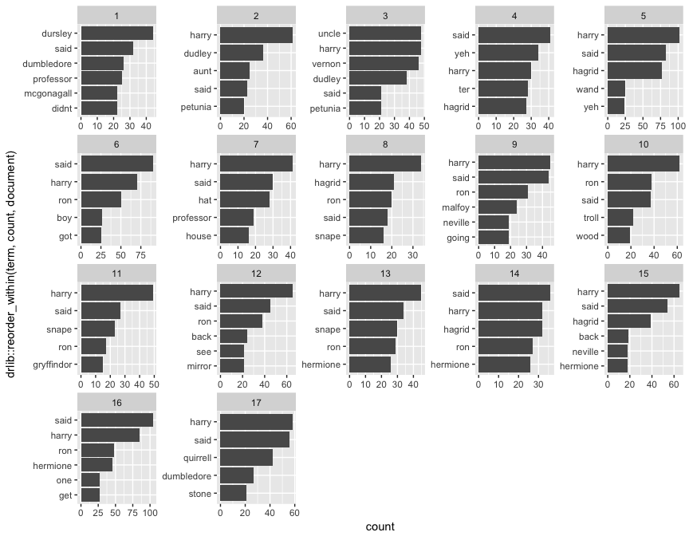

In the previous text mining tutorials, we’ve been analyzing text using the __*tidy text*__ format: a table with one-token-per-document-per-row, such as is constructed by the `unnest_tokens` function. This allows us to efficiently pipe our analysis directly into the popular suite of tidy tools such as [`dplyr`](dplyr), [`tidyr`](tidyr), and [`ggplot2`](ggplot) to explore and visualize text data. We’ve demonstrated that many informative text analyses can be performed using these tools.

However, most of the existing R tools for natural language processing, with the exception of the `tidytext` package, do not use a tidy text format. The [CRAN Task View for Natural Language Processing](https://cran.r-project.org/web/views/NaturalLanguageProcessing.html) lists a large selection of packages that take other structures of input and provide non-tidy outputs. These packages are very useful in text mining applications, and many existing text datasets are structured according to these formats. Thus, its extremely important to understand how to convert back-and-forth between different formats.

The below image illustrates how an analysis might switch between tidy and non-tidy data structures and tools. 


## tl'dr

This tutorial will focus on the process of tidying document-term matrices, as well as casting a tidy data frame into a __*sparse matrix*__. We’ll also expore how to tidy Corpus objects, which combine raw text with document metadata, into text data frames, leading to a case study of ingesting and analyzing financial articles.

1. [Replication requirements](#rep): What you’ll need to reproduce the analysis in this tutorial
2. [Tidying a document-term matrix](#tidydtm): Tidying the most common text mining data structure


## Replication Requirements {#rep}

This tutorial leverages the data provided in the [`harrypotter` package](https://github.com/bradleyboehmke/harrypotter).  I constructed this package to supply the first seven novels in the Harry Potter series to illustrate text mining and analysis capabilities.  You can load the `harrypotter` package with the following:


```r
if (packageVersion("devtools") < 1.6) {
  install.packages("devtools")
}

devtools::install_github("bradleyboehmke/harrypotter")
```


```r
library(tidyverse)      # data manipulation & plotting
library(stringr)        # text cleaning and regular expressions
library(tidytext)       # provides additional text mining functions
library(harrypotter)    # provides the first seven novels of the Harry Potter series
```

The seven novels we are working with, and are provided by the `harrypotter` package, include:

- `philosophers_stone`: Harry Potter and the Philosophers Stone (1997)
- `chamber_of_secrets`: Harry Potter and the Chamber of Secrets (1998)
- `prisoner_of_azkaban`: Harry Potter and the Prisoner of Azkaban (1999)
- `goblet_of_fire`: Harry Potter and the Goblet of Fire (2000)
- `order_of_the_phoenix`: Harry Potter and the Order of the Phoenix (2003)
- `half_blood_prince`: Harry Potter and the Half-Blood Prince (2005)
- `deathly_hallows`: Harry Potter and the Deathly Hallows (2007)

Each text is in a character vector with each element representing a single chapter.  For instance, the following illustrates the raw text of the first two chapters of the `philosophers_stone`:


```r
philosophers_stone[1:2]
## [1] "THE BOY WHO LIVED　　Mr. and Mrs. Dursley, of number four, Privet Drive, were proud to say that they 
## were perfectly normal, thank you very much. They were the last people you'd expect to be involved in anything 
## strange or mysterious, because they just didn't hold with such nonsense.　　Mr. Dursley was the director of a 
## firm called Grunnings, which made drills. He was a big, beefy man with hardly any neck, although he did have a 
## very large mustache. Mrs. Dursley was thin and blonde and had nearly twice the usual amount of neck, which came
## in very useful as she spent so much of her time craning over garden fences, spying on the neighbors. The 
## Dursleys had a small son called Dudley and in their opinion there was no finer boy anywhere.　　The Dursleys 
## had everything they wanted, but they also had a secret, and their greatest fear was that somebody would 
## discover it. They didn't think they could bear it if anyone found out about the Potters. Mrs. Potter was Mrs. 
## Dursley's sister, but they hadn'... <truncated>
## [2] "THE VANISHING GLASS　　Nearly ten years had passed since the Dursleys had woken up to find their nephew on
## the front step, but Privet Drive had hardly changed at all. The sun rose on the same tidy front gardens and lit
## up the brass number four on the Dursleys' front door; it crept into their living room, which was almost exactly
## the same as it had been on the night when Mr. Dursley had seen that fateful news report about the owls. Only
## the photographs on the mantelpiece really showed how much time had passed. Ten years ago, there had been lots
## of pictures of what looked like a large pink beach ball wearing different-colored bonnets -- but Dudley Dursley
## was no longer a baby, and now the photographs showed a large blond boy riding his first bicycle, on a carousel 
## at the fair, playing a computer game with his father, being hugged and kissed by his mother. The room held no
## sign at all that another boy lived in the house, too.　　Yet Harry Potter was still there, asleep at the
## moment, but no... <truncated>
```


## Tidying a Document-term Matrix {##tidydtm}

One of the most common structures that text mining packages work with is the [document-term matrix](https://en.wikipedia.org/wiki/Document-term_matrix) (or DTM). This is a matrix where:

- each row represents one document (such as a book or article),
- each column represents one term, and
- each value (typically) contains the number of appearances of that term in that document.

Since most pairings of document and term do not occur (they have the value zero), DTMs are usually implemented as sparse matrices. These objects can be treated as though they were matrices (for example, accessing particular rows and columns), but are stored in a more efficient format. We’ll discuss several implementations of these matrices in this tutorial.

DTM objects cannot be used directly with tidy tools, just as tidy data frames cannot be used as input for most text mining packages. Thus, the `tidytext` package provides two functions that convert between the two formats.

- __`tidy()`__ turns a document-term matrix into a tidy data frame. This function comes from the `broom` package, which provides similar tidying functions for many statistical models and objects.
- __`cast()`__ turns a tidy one-term-per-row data frame into a matrix. `tidytext` provides three variations of this function, each converting to a different type of matrix: `cast_sparse()` (converting to a sparse matrix from the Matrix package), `cast_dtm()` (converting to a DocumentTermMatrix object from tm), and `cast_dfm()` (converting to a dfm object from quanteda).

As shown in the introductory figure above, a DTM is typically comparable to a tidy data frame after a `count` or a `group_by`/`summarize` that contains counts or another statistic for each combination of a term and document.

### Tidying DocumentTermMatrix Objects

Perhaps the most widely used implementation of DTMs in R is the `DocumentTermMatrix` class in the `tm` package. Many available text mining datasets are provided in this format.  Here, we convert the `philosophers_stone` data into a `DocumentTermMatrix`:


```r
library(tm)

ps_dtm <- VectorSource(philosophers_stone) %>%
  VCorpus() %>%
  DocumentTermMatrix(control = list(removePunctuation = TRUE,
                                    removeNumbers = TRUE,
                                    stopwords = TRUE))

inspect(ps_dtm)
## <<DocumentTermMatrix (documents: 17, terms: 8383)>>
## Non-/sparse entries: 20435/122076
## Sparsity           : 86%
## Maximal term length: 29
## Weighting          : term frequency (tf)
## Sample             :
##     Terms
## Docs back didnt got hagrid harry hermione like one ron said
##   1    15    22   7     10    17        0    9   6   0   32
##   10   10     6   9      0    62       15    9  13  38   37
##   12   24    15   7     18    65        5   20  18  38   45
##   15   19    12  10     39    65       18   12  16  10   54
##   16   16    19  23     14    85       45   12  27  48  104
##   17   15    10  13      9    58       11   11  16  17   56
##   5    19    13  16     77   102        0   13  20   0   83
##   6    19    17  25      9    70        8   11  19  50   90
##   7     9    10  10      3    41        2   13  14   9   30
##   9    17    11  11      2    45       13    9   8  31   44
```

We see that this dataset contains documents (chapters 1-17 of `philosophers_stone`) and terms (distinct words). Notice that this DTM is 86% sparse (86% of document-word pairs are zero). We could access the terms in the document with the `Terms()` function.


```r
terms <- Terms(ps_dtm)
head(terms)
## [1] "　　a"                   "　　aaaargh　　quirrell"
## [3] "　　aha"                 "　　all"                
## [5] "　　and"                 "　　as"
```

If we wanted to analyze this data with tidy tools, we would first need to turn it into a data frame with one-token-per-document-per-row. The broom package introduced the `tidy()` function, which takes a non-tidy object and turns it into a tidy data frame. The `tidytext` package implements this method for DocumentTermMatrix objects.


```r
ps_tidy <- tidy(ps_dtm)
ps_tidy
## # A tibble: 20,435 × 3
##    document           term count
##       <chr>          <chr> <dbl>
## 1         1 　　dumbledore     1
## 2         1         　　my     1
## 3         1        　　yes     1
## 4         1           able     2
## 5         1         across     2
## 6         1            act     1
## 7         1         acting     1
## 8         1       admiring     1
## 9         1         affect     1
## 10        1      afternoon     1
## # ... with 20,425 more rows
```

Notice that we now have a tidy three-column data frame, with variables *document*, *term*, and *count*.  This form is convenient for analysis with the `dplyr`, `tidytext` and `ggplot2` packages. For example, we can efficiently roll into a frequency analysis with this data structure to identify the top 5 most used terms in each chapter:


```r
ps_tidy %>%
  group_by(document) %>%
  top_n(5) %>%
  ungroup() %>%
  mutate(document = factor(as.numeric(document), levels = 1:17)) %>%
  ggplot(aes(drlib::reorder_within(term, count, document), count)) +
  geom_bar(stat = "identity") +
  drlib::scale_x_reordered() +
  coord_flip() +
  facet_wrap(~ document, scales = "free")
```




